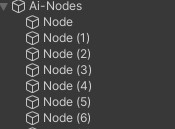
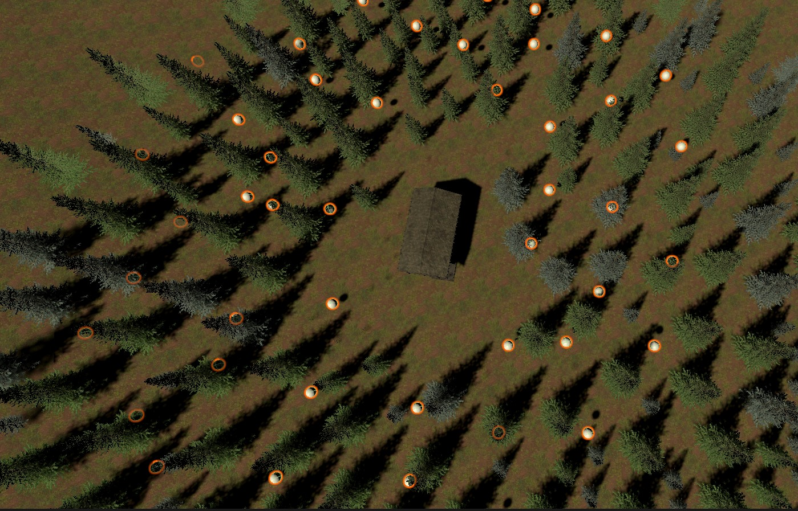
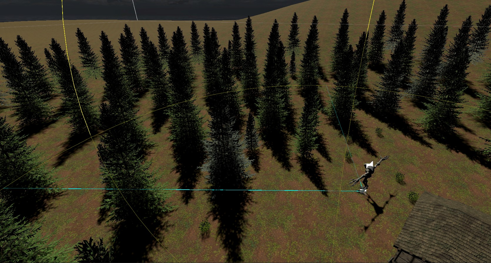
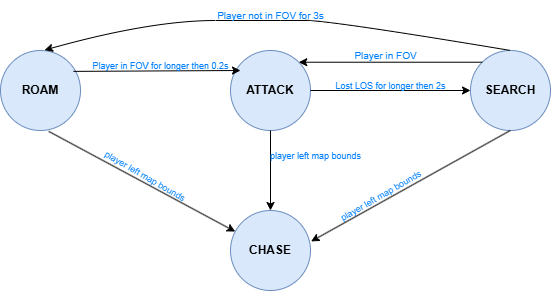

# Monster AI FSM for Unity

This  project contains a fully functional AI enemy controlled by a **Finite State Machine**, designed for intelligent and creepy behavior. The AI roams the map, detects the player through field of view checks, searches intelligently using navigation nodes, and enters a high-speed chase when the player exits the safe zone.

---

## Basic Overview

The AI system is structured around four primary states:
- **Roam**
- **Attack**
- **Search**
- **Chase**

Each state defines a specific behavior, and transitions occur based on detection logic, line of sight, player proximity, and custom conditions.

The project uses **NavMeshAgent** for pathfinding and a **custom FSM** (implemented in code, no third-party tools required) and animation syncing are also included.

---

## AI Node Mechanics

In the **Roam** state, the AI navigates using "AI Nodes" — a collection of transform positions scattered throughout the map.

These nodes are structured like this in the Unity hierarchy:

### How Node Navigation Works (ROAM state)

1. **Start at closest node**
2. **Mark it as visited** (added to a queue)
3. **Queue the closest node for after the next**
4. **Travel to a far node (30+ units)**
5. **Return to queued node**
6. **Repeat** — all while avoiding visiting the same 5 nodes in a row

The AI uses this method to simulate a search routine that looks deliberate and intelligent.

---

## States and Behaviors

### Roam
- Wanders using AI nodes.
- Chooses nearest and farthest nodes alternately to create believable patrols.
- Checks FOV for player detection.

### Attack
- Directly chases the player’s position.
- Updates last known position if player is in sight.
- Faster speed than roam.

### Search
- Moves to last known player location.
- Executes a look-around routine (rotating left, center, right).
- Returns to Roam if player is not found within 3 seconds.

### Chase
- Triggered if the player moves outside the map’s safe border (`mapBorder`).
- AI speed increases dramatically.
- Locks into this state permanently.
- Plays custom chase sounds and ignores other logic.

---

## Transitions and Triggers

| **From** | **To** | **Trigger** |
|----------|--------|-------------|
| Roam     | Attack | Player seen in FOV for > 0.2s |
| Attack   | Search | Player lost for > 2s |
| Search   | Attack | Player seen during search |
| Search   | Roam   | Player not found for 3s |
| *Any*    | Chase  | Player is outside map border (70+ units from origin) |

---

## Extra Features

- Smooth animation syncing with speed parameter
- Customizable detection range, chase threshold, and timers

---

**More Visualization:**

